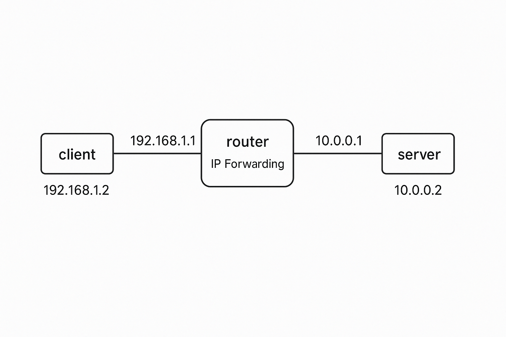

# 🔥 Linux Firewall & QoS Labs

A practical lab series for learning and implementing Linux firewall, NAT, and Quality of Service (QoS) concepts using `iptables`, `iproute2`, `tc`, `netfilter`, and `L7-filter`. All labs are designed to run in a **Proxmox environment** using **LXC containers** or **VMs**.

<p align="center">
  
</p>

---

## 🧠 Why This Project?

This repo helps engineers and learners:
- Understand how Linux handles packet filtering, routing, and traffic shaping.
- Build a portfolio of hands-on labs to showcase practical networking and system administration skills.
- Simulate real-world firewall and QoS scenarios in a virtual lab environment.

---

## 📚 Topics Covered

- 🔁 IP Forwarding and Routing
- 🌐 NAT & Port Forwarding
- 🔐 Stateless and Stateful Firewalls
- ⏳ Rate Limiting
- ⚖️ QoS & Traffic Prioritization
- 🧠 Application Layer Filtering (L7)
- 🛡️ Dynamic Firewalls with `ipset` and `fail2ban`

---

## 🧪 Lab Index

| Lab | Title                          | Description                                      |
|-----|--------------------------------|--------------------------------------------------|
| 01  | IP Forwarding & Routing        | Configure basic routing and forwarding           |
| 02  | NAT (MASQUERADE)               | Share internet access from a container           |
| 03  | Basic iptables Firewall        | Accept/Drop specific traffic using iptables      |
| 04  | Stateful Firewall              | Use connection tracking for filtering            |
| 05  | Port Forwarding (DNAT)         | Redirect public traffic to internal services     |
| 06  | Rate Limiting SSH              | Prevent brute-force attacks                      |
| 07  | QoS with iproute2 & tc         | Limit bandwidth and simulate throttling          |
| 08  | Traffic Prioritization         | Prioritize VoIP and deprioritize downloads       |
| 09  | Application Layer Filtering    | Block apps like P2P or YouTube                   |
| 10  | Dynamic IP Banning (ipset)     | Auto-block IPs from logs using ipset             |

---

## ⚙️ Environment Setup

> Choose either LXC containers or VMs

- 📁 [`lab-setup/lxc`](lab-setup/lxc): Scripts to spin up containers and virtual networks in Proxmox.
- 📁 [`lab-setup/vm`](lab-setup/vm): VM templates, cloud-init configs, and setup guides.

All labs assume:
- Proxmox VE with LXC or KVM support
- Ubuntu/Debian containers or VMs (Alpine optional for lightweight scenarios)

---

## 📁 Folder Structure

```text
linux-firewall-labs/
├── labs/                    # Each lab has its own folder
├── lab-setup/               # LXC and VM setup scripts
├── scripts/                 # Reusable scripts for iptables, QoS, etc.
├── docs/                    # Diagrams, overviews, and references
├── ansible/                 # Optional automation for lab setup
└── README.md
